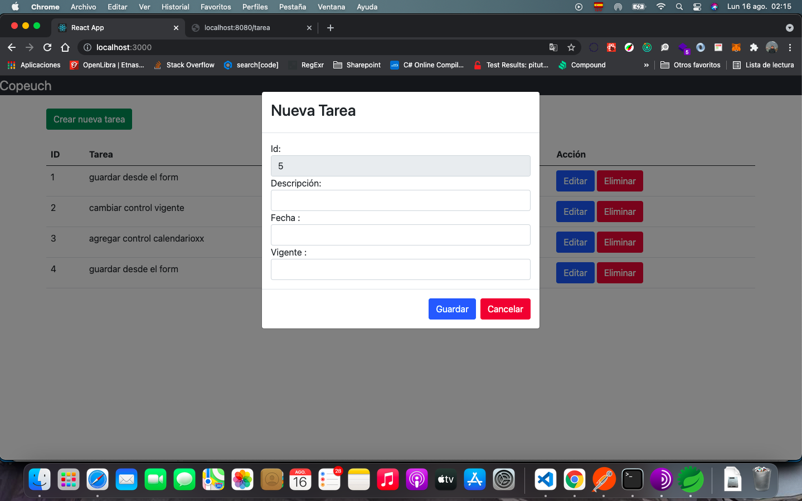

# Mantenedor de tareas

{width=1439 height=900}

# Requeriemientos
npm install react-bootstrap@next bootstrap@5.0.2

npm install --save react-router-dom

npm install axios

npm install react-redux

npm install --save redux-devtools-extension

npm install --save redux-thunk

npm install --save reactstrap react react-dom

# Ejecutar aplicación

En el proyecto ejecutar:

### `npm start`

Abrir [http://localhost:3000](http://localhost:3000) 

# Ejecutar test unitarios

### `npm run test`

